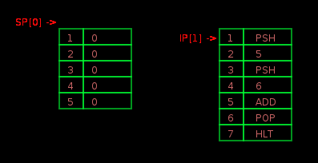
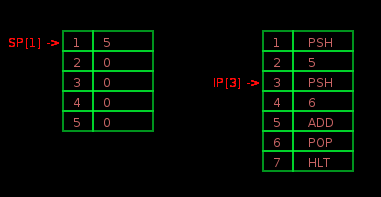
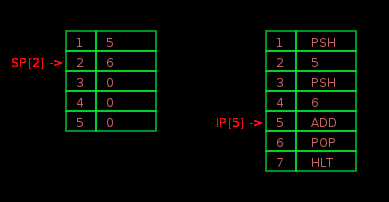
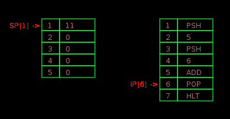
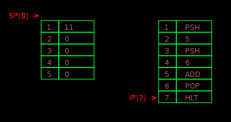

# miniVM

A mini virtual machine written by lua

## Instructions

```
op   val    usage               function
---------------------------------------------------------------------
HLT  0      hlt                 halts program
PSH  1      psh val             pushes <val> to stack
POP  2      pop                 pops value from stack
ADD  3      add                 adds top two vals on stack
```

## Visual

Use [Love2D](https://love2d.org) for the visual.

The sceenshot:







BLOG [用 Lua 实现一个微型虚拟机-基本篇](https://github.com/FreeBlues/miniVM/blob/master/用%20Lua%20实现一个微型虚拟机-基本篇.md)

## Reference 

From this project [MAC](https://github.com/felixangell/mac)
