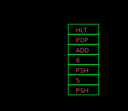
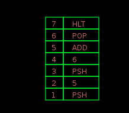
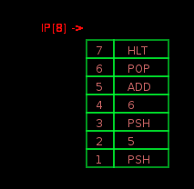
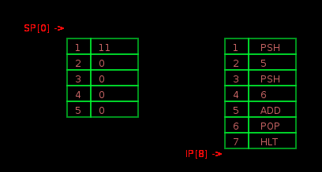

#	用 Lua 实现一个微型虚拟机-基本篇

#	目录

-	[介绍](#)
-	[机器指令模拟](#)
-	[最终代码](#)
-	[虚拟机内部状态可视化](#)
-	[后续计划](#)
-	[参考](#)


##	介绍

在网上看到一篇文章 [使用 C 语言实现一个虚拟机](http://www.mincoder.com/article/5662.shtml), 这里是他的代码 [Github示例代码](https://github.com/felixangell/mac), 觉得挺有意思, 作者用很少的一些代码实现了一个可运行的虚拟机, 所以打算尝试用 `Lua` 实现同样指令集的虚拟机, 同时也仿照此文写一篇文章, 本文中大量参考引用了这位作者的文章和代码, 在此表示感谢.

###	准备工作:
	
-	一个 `Lua` 环境
-	文本编辑器
-	基础编程知识

###	为什么要写这个虚拟机?

原因是: 很有趣, 想象一下, 做一个非常小, 但是却具备基本功能的虚拟机是多么有趣啊!

###	指令集

谈到虚拟机就不可避免要提到指令集, 为简单起见, 我们这里使用跟上述那篇文章一样的指令集, 硬件假设也一样:

-	寄存器:	本虚拟机有那么几个寄存器: `A,B,C,D,E,F`, 这些也一样设定为通用寄存器, 可以用来存储任何东西. 
-	程序:	本虚拟机使用的程序将会是一个只读指令序列.
-	堆栈:	本虚拟机是一个基于堆栈的虚拟机, 我们可以对这个堆栈进行压入/弹出值的操作.

这样基于堆栈的虚拟机的实现要比基于寄存器的虚拟机的实现简单得多.

示例指令集如下:

```
PSH 5       ; pushes 5 to the stack
PSH 10      ; pushes 10 to the stack
ADD         ; pops two values on top of the stack, adds them pushes to stack
POP         ; pops the value on the stack, will also print it for debugging
SET A 0     ; sets register A to 0
HLT         ; stop the program
```

注意，`POP` 指令将会弹出堆栈最顶层的内容, 然后把堆栈指针, 这里为了方便观察, 我们会设置一条打印命令，这样我们就能够看到 `ADD` 指令工作了。我还加入了一个 `SET` 指令，主要是让你理解寄存器是可以访问和写入的。你也可以自己实现像 `MOV A B`（将A的值移动到B）这样的指令。`HTL` 指令是为了告诉我们程序已经运行结束。

说明: 原文的 `C语言版` 在对堆栈的处理上不太准确, 没有把 `stack` 的栈顶元素 "弹出", 在 `POP` 和 `ADD` 后, `stack` 中依然保留着应该弹出的数据,, 

###	虚拟机工作原理

这里也是本文的核心内容, 实际上虚拟机很简单, 遵循这样的模式: 

-	读取:	首先，我们从指令集合或代码中读取下一条指令
- 	解码:	然后将指令解码
-	执行:	执行解码后的指令

为聚焦于真正的核心, 我们现在简化一下这个处理步骤, 暂时忽略虚拟机的编码部分, 因为比较典型的虚拟机会把一条指令(包括操作码和操作数)打包成一个数字, 然后再解码这个数字, 因此, 典型的虚拟机是可以读入真实的机器码并执行的.

###	项目文件结构

正式开始编程之前, 我们需要先设置好我们的项目. 我是在 `OSX` 上写这个虚拟机的, 因为 `Lua` 的跨平台特性, 所以你也可以在 `Windows` 或 `Linux` 上无障碍地运行这个虚拟机. 

首先, 我们需要一个 `Lua` 运行环境(我使用`Lua5.3.2`), 可以从官网下载对应于你的操作系统的版本. 其次我们要新建一个项目文件夹, 因为我打算最终把这个项目分享到 `github` 上, 所以用这个目录 `~/GitHub/miniVM`, 如下:

```
Air:GitHub admin$ cd ~/GitHub/miniVM/
Air:miniVM admin$
```

如上，我们先 `cd` 进入 `~/GitHub/miniVM`，或者任何你想放置的位置，然后新建一个 `lua` 文件 `miniVM.lua`。 因为现在项目很简单, 所以暂时只有这一个代码文件。

运行也很简单, 我们的虚拟机程序是 `miniVM.lua`, 只需要执行:

```
lua miniVM.lua
```

##	机器指令集

现在开始为虚拟机准备要执行的代码了. 首先, 我们需要定义虚拟机使用的机器指令集.

###	指令集数据结构设计

我们需要用一种数据结构来模拟虚拟机中的指令集.

####	C语言版

在 `C语言版` 中, 作者用枚举类型来定义机器指令集, 因为机器指令基本上都是一些从 `0` 到 `n` 的数字, 我们就像在编辑一个汇编文件, 使用类似 `PSH` 之类的助记符, 再翻译成对应的机器指令.

假设助记符 `PSH` 对应的机器指令是 `0`, 也就是把 `PSH, 5` 翻译为 `0, 5`, 但是这样我们读起来会比较费劲, 因为在 `C` 中, 以枚举形式写的代码更具可读性, 所以 `C语言版` 作者选择了使用枚举来设计机器指令集, 如下:

```
typedef enum {
   PSH,
   ADD,
   POP,
   SET,
   HLT
} InstructionSet;
```

####	Lua版的其他方案

看看我们的 `Lua` 版本如何选择数据结构, 众所周知 `Lua` 只有一种基本数据结构: `table`, 因此我们如果想使用枚举这种数据结构. 就需要写出 `Lua` 版的枚举来, 在网络上搜到这两篇文档:

-	[Lua 与C/C++ 交互系列:注册枚举enum到Lua Code中](http://blog.csdn.net/sunning9001/article/details/46659163)
-	[Lua封装创建枚举类型](http://blog.csdn.net/zhenyu5211314/article/details/50098021)

第一篇是直接用 `Lua` 使用 `C` 定义的枚举, 代码比较多, 就不在这里列了, 不符合我们这个项目对于简单性的要求.

第二篇是用`Lua`的`table` 模拟实现了一个枚举, 代码比较短, 列在下面.

```
function CreateEnumTable(tbl, index)   
    local enumtbl = {}   
    local enumindex = index or 0   
    for i, v in ipairs(tbl) do   
        enumtbl[v] = enumindex + i   
    end   
    return enumtbl   
end  

local BonusStatusType = CreateEnumTable({"NOT_COMPLETE", "COMPLETE", "HAS_TAKE"},-1)  
```

不过这种实现对我们来说也不太适合, 一方面写起来比较繁琐, 另一方面代码也不太易读, 所以需要设计自己的枚举类型.

####	最终使用的Lua版

现在的方案是直接选择用一个 `table` 来表示, 如下:

```
InstructionSet = {"PSH","ADD","POP","SET","HLT"}
```

这样的实现目前看来最简单, 可读性也很不错, 不过缺乏扩展性, 我们暂时就用这种方案.

###	测试程序数据结构设计

现在需要一段用来测试的程序代码了, 假设是这样一段程序: 把 `5` 和 `6` 相加, 把结果打印出来.

在 `C语言版` 中, 作者使用了一个整型数组来表示该段测试程序, , 如下:

```
const int program[] = {
    PSH, 5,
    PSH, 6,
    ADD,
    POP,
    HLT
};
```

>注意: `PSH` 是前面 `C语言版` 定义的枚举值, 是一个整数 `0`, 其他类似.

我们的 `Lua` 版暂时使用最简单的结构:表, 如下:

```
program = {
	"PSH", "5",
	"PSH", "6",
	"ADD",
	"POP",
	"HLT"
}
```

这段代码具体来说, 就是把 `5` 和 `6` 分别先后压入堆栈, 调用 `ADD` 指令, 它会将栈顶的两个值弹出, 相加后再把结果压回栈顶, 然后我们用 `POP` 指令把这个结果弹出, 最后 `HLT` 终止程序.

很好, 我们有了一个完整的测试程序. 现在, 我们描述了虚拟机的`读取, 解码, 求值` 的详细过程. 但是实际上我们并没有做任何解码操作, 因为我们这里提供的就是原始的机器指令. 也就是说, 我们后续只需要关注 `读取` 和 `求值` 两个操作. 我们将其简化为 `fetch` 和 `eval` 两个函数.

###	从测试程序中取得当前指令

因为我们的 `Lua` 版把测试程序存为一个字符串表 `program ` 的形式, 因此可以很简单地取得任意一条指令.

虚拟机有一个用来定位当前指令的地址计数器, 一般被称为 `指令指针` 或 `程序计数器`, 它指向即将执行的指令, 通常被命名为 `IP` 或 `PC`. 在我们的 `Lua` 版中, 因为表的索引以 `1` 开始, 所以这样定义:

```
-- 指令指针初值设为第一条
IP = 1
```

那么结合我们的 `program` 表, 很容易理解 `program[IP]` 的含义: 它以 `IP` 作为表的索引值, 去取 `program` 表中的第 `1` 条记录, 完整代码如下:

```
IP = 1
instr = program[IP];
``` 
如果我们打印 `instr` 的值, 会返回字符串 `PSH`, 这里我们可以写一个取指函数 `fetch`, 如下:

```
function fetch()
	return program[IP]
end
```

该函数会返回当前被调用的指令, 那么我们想要取得下一条指令该如何呢? 很简单, 只要把指令指针 `IP` 加 `1` 即可:

```
x = fetch()	-- 取得指令 PSH
IP = IP + 1	-- 指令指针加 1
y = fetch()	-- 取得操作数 5 
```

我们知道, 虚拟机是会自动执行的, 比如指令指针会在每执行一条指令时自动加 `1` 指向下一条指令, 那么我们如何让这个虚拟机自动运行起来呢? 因为一个程序直到它执行到 `HLT` 指令时才会停止, 所以我们可以用一个无限循环来模拟虚拟机, 这个无限循环以遇到 `HLT` 指令作为终止条件, 代码如下:

```
running = true
-- 设置指令指针指向第一条指令
IP = 1
while running do
	local x = fetch()
	if x == "HLT" then running = false end
	IP = IP + 1	
end
```

>说明: 代码中的 `local` 表示 `x` 是一个局部变量, 其他不带 `local` 的都是全局变量 

一个虚拟机最基本的核心就是上面这段代码了, 它揭示了最本质的东西, 我们可以把上面这段代码看做一个虚拟机的原型代码, 更复杂的虚拟机都可以在这个原型上扩展.

不过上面这段代码什么具体工作也没做, 它只是顺序取得程序中的每条指令, 检查它们是不是停机指令 `HLT`, 如果是就跳出循环, 如果不是就继续检查下一条, 相当于只执行了 `HLT`.

###	执行每一条指令

但是我们希望虚拟机还能够执行其他指令, 那么就需要我们对每一条指令分别进行处理了, 这里最适合的语法结构就是 `C语言` 的 `switch-case` 了, 让 `switch` 中的每一个 `case` 都对应一条我们定义在指令集 `InstructionSet` 中的机器指令, 在 `C语言版` 中是这样的:

```
void eval(int instr) {
    switch (instr) {
        case HLT:
            running = false;
            break;
    }
}
```

不过 `Lua` 没有 `switch-case` 这种语法, 我们就用 `if-then-elseif` 的结构来写一个指令执行函数, 也就是一个求值函数 `eval`, 处理 `HLT` 指令的代码如下:

```
function eval(instr)
	if instr == "HLT" then 
		running = false
	end
end
```

我们可以这样调用 `eval` 函数:

```
running = true
IP = 1
while running do
	eval(fetch())
	IP = IP + 1
end
```

增加对其他指令处理的 `eval`:

```
function eval(instr)
	if instr == "HLT" then 
		running = false
	elseif instr == "PSH" then
		-- 这里处理 PSH 指令, 具体处理后面添加
	elseif instr == "POP" then
		-- 这里处理 POP 指令, 具体处理后面添加
	elseif instr == "ADD" then
		-- 这里处理 ADD 指令, 具体处理后面添加
	end
end
```

###	栈的数据结构设计

因为我们的这款虚拟机是基于栈的, 一切的数据都要从存储器搬运到栈中来操作, 所以我们在为其他指令增加具体的处理代码之前, 需要先准备一个栈. 

>注意: 我们这里要使用一种最简单的栈结构:数组

在 `C语言版` 中使用了一个固定长度为 `256` 的数组, 同时需要一个栈指针 `SP`, 它其实就是数组的索引, 用来指向栈中的元素, 如下:

```
int sp = -1;
int stack[256]; 
```

我们的 `Lua` 版也准备用一个最简单的表来表示栈, 如下:

```
SP = 0
stack = {}
```

>注意: 我们知道 `C` 的数组是从 `0` 开始的, 而 `Lua` 的数组是从 `1` 开始的, 所以我们的代码中以 `1` 作为数组的开始, 那么 `SP` 的初值就要设置为 `0`.

###	各种指令执行时栈状态变化的分析

下面是一个形象化的栈, 最左边是栈底, 最右边是栈顶:

```
[] // empty
PSH 5 // put 5 on **top** of the stack
[5]
PSH 6
[5, 6]
POP
[5]
POP
[] // empty
PSH 6
[6]
PSH 5
[6, 5]
```

先手动分析一下我们的测试程序代码执行时栈的变化情况, 先列出测试程序:

```
PSH, 5,
PSH, 6,
ADD,
POP,
HLT
```

先执行 `PSH, 5,` 也就是把 `5` 压入栈中, 栈的情况如下:

```
[5]
```

再执行 `PSH, 6,` 也就是把 `6` 压入栈中, 栈的情况如下:

```
[5,6]
```

再执行 `ADD`, 因为它需要 `2` 个参数, 所以它会主动从栈中弹出最上面的 `2` 个值, 把它们相加后再压入栈中, 相当于执行 `2` 个 `POP`, 再执行一个 `PSH`, 栈的情况如下:

```
[5, 6]
// pop the top value, store it in a variable called a
a = pop; // a contains 6
[5] // stack contents
// pop the top value, store it in a variable called b
b = pop; // b contains 5
[] // stack contents
// now we add b and a. Note we do it backwards, in addition
// this doesn't matter, but in other potential instructions
// for instance divide 5 / 6 is not the same as 6 / 5
result = b + a;
push result // push the result to the stack
[11] // stack contents
```

上面这段描述很重要, 理解了这个你才清楚如何用代码来模拟栈的操作.

上述没有提到栈指针 `SP` 的变化, 实际上它默认指向栈顶元素, 也就是上述栈中最右边那个元素的索引, 我们看到, 最右边的元素的索引是一直变化的.

空的栈指针在 `C语言版` 的虚拟机中被设置为 `-1`.

如果我们在栈中压入 `3` 个值, 那么栈的情况如下:

```
SP指向这里（SP = 3）
       |
       V
[1, 5, 9]
 1  2  3  <- 数组下标
```

现在我们先从栈上弹出 `POP` 出一个值, 我们如果只修改栈指针 `SP`, 让其减 `1`, 如下:

```
SP指向这里（SP = 2）
    |
    V
[1, 5, 9]
 1  2 <- 数组下标
```

>注意: 我们不能指定弹出栈中的某个元素, 只能弹出位于栈顶的元素

因为我们是最简版的山寨栈, 所以执行弹出指令时只修改栈指针的话, 栈中的那个应该被弹出的 `9` 实际上还在数组里, 所以我们在模拟 `POP` 指令时需要手动把弹出的栈顶元素从栈中删除, 这样做的好处在后面可视化时就清楚了.

###	各指令的处理逻辑

经过上面的详细分析, 我们应该对执行 `PSH` 和 `POP` 指令时栈的变化(特别是栈指针和栈数组)比较清楚了, 那么先写一下压栈指令 `PSH 5` 的处理逻辑, 当我们打算把一个值压入栈中时, 先调整栈顶指针的值, 让其加 `1`, 再设置当前 `SP` 处栈的值 `stack[SP]`, 注意这里的执行顺序:

```
SP = -1;
stack = {};

SP = SP + 1
stack[SP] = 5
```

在 `C语言版` 中写成这样的:

```
void eval(int instr) {
    switch (instr) {
        case HLT: {
            running = false;
            break;
        }
        case PSH: {
            sp++;
            stack[sp] = program[++ip];
            break;
        }
    }
}
```

`C语言版`作者用了不少 `sp++`, `stack[sp] = program[++ip]` 之类的写法, 但是我觉得这里这么用会降低易读性, 因为读者不太容易看出执行顺序, 不如拆开来写成 `sp = sp + 1` 跟 `ip = ip + 1`, 这样看起来更清楚.

所以在我们 `Lua` 版的 `eval` 函数中, 可以这样写 `PSH` 指令的处理逻辑:

```
function eval(instr)
	if instr == "HLT" then 
		running = false
	elseif instr == "PSH" then
		-- 这里处理 PSH 指令, 具体处理如下
		SP = SP + 1
		-- 指令指针跳到下一个, 取得 PSH 的操作数
		IP = IP + 1
		stack[SP] = program[IP]
	elseif instr == "POP" then
		-- 这里处理 POP 指令, 具体处理后面添加   
	elseif instr == "ADD" then  
		-- 这里处理 ADD 指令, 具体处理后面添加
	end
end
```

分析一下我们的代码, 其实很简单, 就是发现当指令是 `PSH` 后, 首先栈顶指针 `SP` 加 `1`, 接着指令指针加 `1`, 取得 `PSH` 指令后面紧跟着的操作数, 然后把栈数组的第一个元素 `stack[SP]`赋值为测试程序数组中的操作数 `program[IP]`.

接着是 `POP` 指令的处理逻辑, 它要把栈顶指针减 `1`, 同时最好从栈数组中删除掉弹出栈的元素:

```
elseif instr == "POP" then
	-- 这里处理 POP 指令, 具体处理如下
	local val_popped = stack[SP]
	SP = SP - 1
elseif ...
```

####	ADD指令的处理逻辑

最后是稍微复杂一些的 `ADD` 指令的处理逻辑, 因为它既有压栈操作, 又有出栈操作, 如下:

```
elseif instr == "ADD" then  
	-- 这里处理 ADD 指令, 具体处理如下
	-- 先从栈中弹出一个值
	local a = stack[SP]
	stack[SP] = 0
	SP = SP - 1
            
	-- 再从栈中弹出一个值
	local b = stack[SP]
	stack[SP] = 0
	SP = SP - 1
	
	-- 把两个值相加
	local result = a + b
         
   	-- 把相加结果压入栈中   
	SP = SP + 1
	stack[SP] = result
end
```

##	最终代码

很好, 现在我们 `Lua` 版的虚拟机完成了, 完整代码如下:

```
-- 项目名称: miniVM
-- 项目描述: 用 Lua 实现的一个基于栈的微型虚拟机
--	项目地址: https://github.com/FreeBlues/miniVM
--	项目作者: FreeBlues

-- 指令集
InstructionSet = {"PSH","ADD","POP","SET","HLT"}
Register = {A, B, C, D, E, F,NUM_OF_REGISTERS}

--	测试程序代码
program = {"PSH", "5", "PSH", "6", "ADD", "POP", "HLT"}

-- 指令指针, 栈顶指针, 栈数组
IP = 1
SP = 0
stack = {}

-- 取指令函数
function fetch()
	return program[IP]
end

-- 求值函数
function eval(instr)
	if instr == "HLT" then 
		running = false
	elseif instr == "PSH" then
		-- 这里处理 PSH 指令, 具体处理如下
		SP = SP + 1
		-- 指令指针跳到下一个, 取得 PSH 的操作数
		IP = IP + 1
		stack[SP] = program[IP]
	elseif instr == "POP" then
		-- 这里处理 POP 指令, 具体处理后面添加 
		local val_popped = stack[SP]
		SP = SP - 1  
	elseif instr == "ADD" then  
		-- 这里处理 ADD 指令, 具体处理如下
		-- 先从栈中弹出一个值
		local a = stack[SP]
		stack[SP] = 0
		SP = SP - 1
            
		-- 再从栈中弹出一个值
		local b = stack[SP]
		stack[SP] = 0
		SP = SP - 1
	
		-- 把两个值相加
		local result = a + b
         
   		-- 把相加结果压入栈中   
		SP = SP + 1
		stack[SP] = result
		
		-- 为方便查看测试程序运行结果, 这里增加一条打印语句
		print(stack[SP])
	end
end

-- 虚拟机主函数
function main()
	running = true
	while running do
		eval(fetch())
		IP = IP + 1
	end
end

-- 启动虚拟机
main()
```

执行结果如下:

```
Air:miniVM admin$ lua miniVM.lua 
11.0
Air:miniVM admin$
```

本项目代码可以到 [Github-miniVM](https://github.com/FreeBlues/miniVM) 下载.


##	虚拟机内部状态可视化

应该说目前为止我们的虚拟机已经完美地实现了, 不过美中不足的是它的一切动作都被隐藏起来, 我们只能看到最终运行结果, 当然了我们也可以增加打印命令来显示各条指令执行时的情况, 但是这里我们打算把虚拟机运行时内部状态的变化用图形的方式绘制出来, 而不仅仅是简单的 `print` 文本字符.

###	框架选择:Love2D

这里我们选择使用 `Love2D` 来绘图, 原因有这么几个:

-	简单好用:结构很简单, 框架很好用
-	跨平台:同时支持 `Windows, Mac OS X, Linux, Android 和 iOS`
- 	免费开源:直接下载了就能用

###	Love2D的简单介绍

用 `Love2D` 写程序非常简单方便, 首先新建一个目录 `love`(目录名可以随便起), 接着在该目录下新建一个文件 `main.lua`(该文件必须使用这个名字), 然后在 `main.lua` 中编写游戏逻辑即可, 可以试试这段代码:

```
function love.draw()
    love.graphics.print("Hello World", 400, 300)
end
```

执行命令是用 `love` 调用目录, 它会自动加载目录内的 `main.lua` 文件, 命令如下:

```
love ./love
```

它会新建一个窗口, 然后打印 `Hello World`.

更详细的可以参考我写的这篇文档[Mac 下安装使用 Love2D](https://my.oschina.net/freeblues/blog/702954)

###	把项目修改为 Love2D 的形式

其实很简单, 就是在项目文件目录下新建个目录 `miniVM`, 然后拷贝 `miniVM.lua` 代码文件到这个新目录中, 并将新目录中的代码文件名修改为 `main.lua`.

```
Air:miniVM admin$ cp ./miniVM.lua ./miniVM/main.lua
Air:miniVM admin$ tree
.
├── README.md
├── miniVM
│   └── main.lua
└── miniVM.lua

1 directory, 3 files
Air:miniVM admin$ 
```

按照 `Love2D` 的代码框架要求修改整合代码, 在 `main.lua` 中增加一个加载函数 `love.load`, 把所有只执行一次的代码放进去, 再增加一个刷新函数 `love.update`, 把所有需要重复执行的代码放进去, 最后增加一个 `love.draw` 函数, 把所有用于绘图的代码放进去, 修改后的 `main.lua` 如下:

```
function love.load()
    -- 指令集
	InstructionSet = {"PSH","ADD","POP","SET","HLT"}
	Register = {A, B, C, D, E, F,NUM_OF_REGISTERS}

	--	测试程序代码
	program = {"PSH", "5", "PSH", "6", "ADD", "POP", "HLT"}

	-- 指令指针, 栈顶指针, 栈数组
	IP = 1
	SP = 0
	stack = {}
	
	running = true
end

function love.update(dt)
    -- 虚拟机主体
	if running then
		eval(fetch())
		IP = IP + 1
	end
end

function love.draw()
    love.graphics.print("Welcome to our miniVM!", 400, 300)
end


-- 取指令函数
function fetch()
	return program[IP]
end

-- 求值函数
function eval(instr)
	if instr == "HLT" then 
		running = false
	elseif instr == "PSH" then
		-- 这里处理 PSH 指令, 具体处理如下
		SP = SP + 1
		-- 指令指针跳到下一个, 取得 PSH 的操作数
		IP = IP + 1
		stack[SP] = program[IP]
	elseif instr == "POP" then
		-- 这里处理 POP 指令, 具体处理后面添加 
		local val_popped = stack[SP]
		SP = SP - 1  
	elseif instr == "ADD" then  
		-- 这里处理 ADD 指令, 具体处理如下
		-- 先从栈中弹出一个值
		local a = stack[SP]
		stack[SP] = 0
		SP = SP - 1
            
		-- 再从栈中弹出一个值
		local b = stack[SP]
		stack[SP] = 0
		SP = SP - 1
	
		-- 把两个值相加
		local result = a + b
         
   		-- 把相加结果压入栈中   
		SP = SP + 1
		stack[SP] = result
		
		-- 为方便查看测试程序运行结果, 这里增加一条打印语句
		print(stack[SP])
	end
end
```

代码整合完毕, 检查无误后用 `Love2D` 加载, 如下:

```
Air:miniVM admin$ pwd
/Users/admin/GitHub/miniVM
Air:miniVM admin$ love ./miniVM
11
Air:miniVM admin$
```
我们会看到弹出一个窗口用于绘制图形, 同时命令行也会返回执行结果.

###	编写绘制函数

目前我们的虚拟机有一个用来模拟存储器保存测试程序指令的 `program` 表, 还有一个用来模拟栈的 `stack` 表, 另外有两个指针, 一个是指示当前指令位置的指令指针 `IP`, 另一个是指示当前栈顶位置的栈顶指针 `SP`, 所以, 我们只需要绘制出这 `4` 个元素在虚拟机运行时的状态变化即可.

####	绘制 program 表和指令指针 IP

首先绘制作为存储器使用的 `program` 表, 我们准备遵循约定俗成的习惯, 用两个连在一起的矩形方框来表示它的基本存储单元, 左边的矩形表示地址, 右边的矩形表示在改地址存放的值, 这里我们会用到 `Love2D` 中这三个基本绘图函数:

-	love.graphics.setColor(0, 100, 100)
-	love.graphics.rectangle("fill", x, y, w, h)
-	love.graphics.print("Welcome to our miniVM!", 400, 300)

我们一步步来, 先绘制右侧矩形和指令, 代码如下:

```
-- 绘制存储器中指令代码的变化
function drawMemory()
	local x,y = 500, 300
	local w,h = 60, 20
	for k,v in ipairs(program) do
		-- 绘制矩形
		love.graphics.setColor(0, 255, 50)
		love.graphics.rectangle("fill", x, y-(k-1)*h, w, h)
		
		--	绘制要执行的指令代码       
		love.graphics.setColor(200, 100, 100)
		love.graphics.print(v, x+15,y-(k-1)*h+5)
               
   end    
end

function love.draw()
	-- love.graphics.print("Welcome to our miniVM!", 400, 300)
	-- 绘制存储器中指令代码的变化
	drawMemory()
end
```

显示效果如下:



接着我们把左侧的地址矩形和地址值, 还有指令指针也绘制出来, 代码如下:

```
-- 绘制存储器中指令代码的变化
function drawMemory()
	local x,y = 500, 300
	local w,h = 60, 20
	for k,v in ipairs(program) do
		-- 绘制存储器右侧矩形
		love.graphics.setColor(0, 255, 50)
		love.graphics.rectangle("line", x, y+(k-1)*h, w, h)
		
		--	绘制存储器中要执行的指令代码       
		love.graphics.setColor(200, 100, 100)
		love.graphics.print(v, x+15,y+(k-1)*h+5)
		
		-- 绘制存储器左侧矩形
		love.graphics.setColor(0, 255, 50)
		love.graphics.rectangle("line", x-w/3-10,y+(k-1)*h,w/3+10, h)
		
		--	绘制表示存储器地址的数字序号      
		love.graphics.setColor(200, 100, 100)
		love.graphics.print(k,x-w/2-10+10,y+(k-1)*h+5)
		
		-- 绘制指令指针 IP
		love.graphics.setColor(255, 10, 10)
		love.graphics.print("IP".."["..IP.."] ->",x-w-10+10-120,y+(IP-1)*h)          
   end    
end
```

显示效果如下:




####	绘制 stack 表和栈顶指针 SP

接下来就是绘制用来模拟栈的 `stack` 表和栈顶指针 `SP` 了, 跟上面类似, 代码如下:

```
-- 绘制栈的变化
function drawStack()
	local x,y = 200, 300
	local w,h = 60, 20
	for k,v in ipairs(stack) do
		-- 显示栈右侧矩形
		love.graphics.setColor(0, 255, 50)
		love.graphics.rectangle("line", x, y+(k-1)*h, w, h)
        
       --	绘制被压入栈内的值       
		love.graphics.setColor(200, 100, 100)
		love.graphics.print(v, x+10,y+(k-1)*h)
		
       
       -- 绘制栈左侧矩形
		love.graphics.setColor(0, 255, 50)
		love.graphics.rectangle("line", x-w-20,y+(k-1)*h,w+20, h) 
		
		--	绘制表示栈地址的数字序号      
		love.graphics.setColor(200, 100, 100)
		love.graphics.print(k,x-w-20+10,y+(k-1)*h)
        
       
		-- 绘制栈顶指针 SP
		love.graphics.setColor(255, 10, 10)
		love.graphics.print("SP".."["..SP.."] ->",x-w-10+10-100,y+(SP-1)*h)
    end    
end

function love.draw()
	-- love.graphics.print("Welcome to our miniVM!", 400, 300)
	-- 绘制存储器中指令代码的变化
	drawMemory()
	drawStack()
end
```

显示效果如下:



很不错的结果, 终于能看到虚拟机这个黑盒子里面的内容了, 不过一下子就执行过去了, 还是有些遗憾, 那么就给它增加一项单步调试的功能好了!

>说明: 因为 `Love2D` 的坐标轴方向是左手系,也就是说 `Y` 轴的正向向下, 所以我们调整了一下 `program` 和 `stack` 的地址顺序, 小序号在上, 大序号在下.

### 增加单步调试功能

其实很简单, 我们只需要在虚拟机的主体执行流程中增加一个判断逻辑, 每执行一条指令后都等待用户的输入, 这里我们设计简单一些, 就是每执行完一条指令, 虚拟机就自动暂停, 如果用户用键盘输入 `s` 键, 则继续执行下一条指令.

需要用到这个键盘函数:

-	love.keyreleased(key)

代码如下:

```
function love.load()
	...
	step = false
end

function love.keyreleased(key)
   if key == "s" then
      step = true
   end
end

function love.update(dt)
    -- 虚拟机主体
	if running then 
		if step then 
			step = false
			eval(fetch())
			IP = IP + 1
		end
	end
end
```

运行中可以通过按下 `s` 键来单步执行每一条指令, 可以看看效果:


到现在为止, 我们的可视化部分完成了, 而且也可以通过用户的键盘输入来单步执行指令, 可以说用 `Lua` 实现微型虚拟机的基本篇顺利完成. 接下来的扩展篇我们打算在这个简单虚拟机的基础上增加一些指令, 实现一个稍微复杂一些的虚拟机, 同时我们可能会修改一些数据结构, 比如我们的指令集的表示方式, 为后面更有挑战性的目标提供一些方便.

##	本项目代码

项目代码保存在 []() 里, 欢迎自由下载

项目文件清单如下:

```
Air:miniVM admin$ tree
.
├── README.md
├── miniVM
│   └── main.lua
├── miniVM.lua
└── pic
    ├── p01.png
    ├── p02.png
    ├── p03.png
    ├── p04.png
    ├── p05.png
    ├── p06.png
    ├── p07.png
    ├── p08.png
    └── p09.png

2 directories, 12 files
Air:miniVM admin$ 
```

##	后续计划

因为这种方式很好玩, 所以我们打算后续在这个基础上实现一个 `Intel 8086` 的虚拟机, 包括完整的指令集, 最终目标是可以在我们的虚拟机上执行 `DOS` 时代的 `x86` 汇编程序代码.

##	参考

-	[使用 C 语言实现一个虚拟机](http://www.mincoder.com/article/5662.shtml)
-	[Lua 与C/C++ 交互系列:注册枚举enum到Lua Code中](http://blog.csdn.net/sunning9001/article/details/46659163)	
-	[Lua封装创建枚举类型](http://blog.csdn.net/zhenyu5211314/article/details/50098021)
